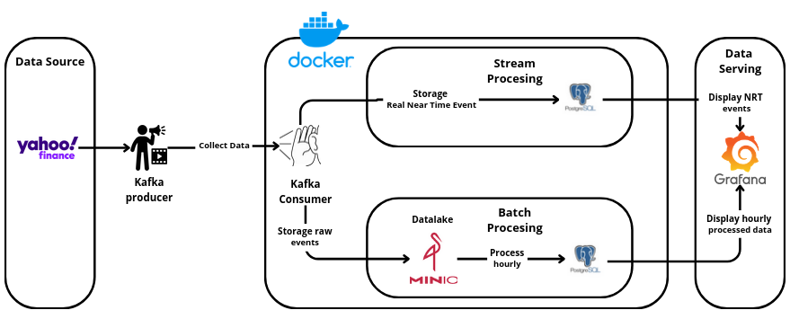

# Lambda Architecture - Real-Time Stock Analytics

This project implements a simplified Lambda Architecture focused on real-time analytics for stock data using Kafka, MinIO, PostgreSQL, and Grafana.

## Architecture Overview



### Real-Time Processing (Speed Layer)

- **Kafka** ingests stock prices via the `stock_prices` topic.
- A listener consumes messages in real time and stores transformed results in PostgreSQL.
- Real-time metrics (e.g. volume, open price, close price) are updated continuously.

### Object Storage (Data Lake)

- **Kafka Connect** stores every ingested event to **MinIO**, a distributed S3-compatible object store.
- This enables historical data access for future analytical use cases (e.g. batch processing, ML pipelines).

### Visualization

- **Grafana** connects to PostgreSQL to visualize real-time metrics.
- Dashboards provide insights such as:
  - average close price per minute (near-real-time)
  - trading volume per symbol per minute

## Services

| Service       | Port(s)    | Purpose                     |
| ------------- | ---------- | --------------------------- |
| Zookeeper     | 2181       | Kafka coordination          |
| Kafka         | 9092       | Event streaming             |
| MinIO         | 9000, 9001 | S3-compatible storage       |
| Kafka Connect | 8083       | Sink connector to MinIO     |
| PostgreSQL    | 5432       | Structured data persistence |
| Grafana       | 3000       | Real-time dashboard         |

## How It Works

1. **Stock events** are sent to Kafka (`stock_prices` topic).
2. Kafka Connect stores events in MinIO.
3. A real-time processing pipeline:
   - Consumes messages.
   - Saves results in PostgreSQL.
4. Grafana connects to PostgreSQL and visualizes the live data.

## Setup

### 1. Clone the repo and start services

```bash
git https://github.com/FinDrum/Lambda-Architecture.git
cd Lambda-Architecture/infrastructure
docker-compose up --build
```

### 2. Run the Real-Time Pipeline

Activate your Python environment.

Install requirements.txt

```bash
pip install -r requirements.txt
```

And run the pipelines

```python
from findrum import Platform

platform = Platform("./config.yaml")
platform.register_pipeline("./pipelines/realtime_pipeline.yaml")
platform.start()
```

### 3. Access interfaces

- MinIO Console: http://localhost:9001 (user: `minioadmin`, pass: `minioadmin`)
- Grafana: http://localhost:3000 (user: `admin`, pass: `admin`)


## Requirements

- Docker & Docker Compose
- Python 3.12+ (if running the pipeline manually)

## Future Improvements

- Add a proper batch layer (e.g. Spark jobs from MinIO)
- Extend monitoring and alerting

---

© 2025 – FinDrum
